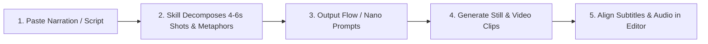

<div align="center">

[简体中文](README.md) · [**English**](README.en.md) · [日本語](README.ja.md) · [한국어](README.ko.md) · [Español](README.es.md)

# 🖍️ Hand-Drawn Video Prompts

### Turn voiceover scripts into consistent 9:16 modern chibi crayon-doodle image and image-to-video prompts.

An open-source AI Skill designed for AI explainers, financial commentary, tech insights, and educational short-form creators. Automatically breaks copy into 4–6 second semantic shots, visual metaphors, English Flow / Nano Banana image prompts, video motion prompts, and embedded hand-drawn keywords—eliminating style drift and subtitle clashes.


<br/>


<br/>

Ideal for: **AI tech explainers, finance commentary, knowledge shorts, business model breakdowns, and TikTok / Reels / Shorts / Xiaohongshu video creation**.

</div>

---

## ✨ Key Features

- ⏱️ **4–6 Second Semantic Shot Breakdown**: Cuts shots by logical argument beats, rhetorical pacing, and narrative emotion rather than arbitrary word counts.
- 🖍️ **Modern Chibi Crayon Doodle Aesthetic**: Fixed `#F8F6EF` warm off-white fine paper texture, thick imperfect ink lines, and classic sunflower yellow / cobalt blue / tomato red accents.
- 🎬 **Dual Prompt Delivery (Still Image + Video Motion)**: Outputs ready-to-copy English image prompts and image-to-video motion prompts for Flow and Nano Banana.
- ✍️ **Embedded Hand-Drawn Keywords**: Short Chinese/English keywords drawn directly onto paper or objects as part of the illustration, strictly reserving bottom space for subtitles.
- 🧑‍💼 **Chibi Tech & Business Caricatures**: Transforms recognizable public figures (e.g., Musk, Jensen Huang, Zuckerberg) into expressive chibi cartoon avatars using safe visual anchors.
- 🎯 **Layered Entity Accuracy**: Provides guidance on flags, logos, numbers, and long text, separating generation from deterministic post-production overlays.

---

## 🎬 Video Showcase (Direct Dynamic Previews)

Watch the animated demo videos generated with this workflow directly (**click GIF to open full HD video with sound**):

<div align="center">

| 📱 Case 1: AI CapEx & Financial Reality (Demo 722) | 📱 Case 2: Tech Validation & Commercialization (Demo 723) |
|:---:|:---:|
| <a href="demo/hand-drawn-video-demo-722.mp4"></a> | <a href="demo/hand-drawn-video-demo-723.mp4"></a> |
| ⏱️ **32s Film** · [Open Full Video 🔊](demo/hand-drawn-video-demo-722.mp4) | ⏱️ **41s Film** · [Open Full Video 🔊](demo/hand-drawn-video-demo-723.mp4) |

</div>

---

## 📋 Example Generated Prompts

<div align="center">

| Shot 01 Still Sample (`#F8F6EF` Canvas) | Shot 02 Still Sample (Visual Metaphor) |
|:---:|:---:|
|  |  |

</div>

### 🎬 Shot 01: Tech Giants GPU Arms Race
> **Source Narration**: "The four tech giants spent $200B on GPUs in a single year, but Wall Street is asking: where is the real return?"  
> **Suggested Duration**: 5 seconds  
> **Visual Metaphor**: Four chibi tech executives pushing wheelbarrows piled with glowing microchips toward a steep peak, under a giant magnifying glass held by a hand in the sky.  
> **On-Image Keyword**: "2000亿" ($200B)

```text
[Flow Image Prompt]
Modern minimalist crayon doodle illustration, vertical 9:16, warm off-white fine-textured paper background #F8F6EF, thick imperfect black ink outlines. Four cute expressive chibi tech executives in simple business attire pushing wheelbarrows piled high with glowing GPU microchips toward a steep mountain peak. In the clean upper sky, a giant whimsical hand with a gold ring holds a magnifying glass inspecting them. Warm sunlight yellow, cobalt blue, tomato red accents. Hand-drawn Chinese text "2000亿" naturally written in black crayon on the side of a wheelbarrow. Clear composition with generous negative space, empty clean area at bottom reserved for subtitles.

[Flow Image-to-Video Prompt]
Gentle 2D hand-drawn stop-motion animation. The four chibi executives strain forward cheerfully pushing their wheelbarrows, wheels wobbling slightly. The magnifying glass in the sky pans smoothly from left to right as a beam of warm light highlights the glowing chips. Tiny paper-grain particles float subtly in the air. Fixed #F8F6EF background color with zero flicker.
```

---

## 🛠️ Workflow



1. **Input Script**: Paste a 30–60 second voiceover script.
2. **Semantic Breakdown**: Skill analyzes logic, assigns pacing, designs metaphors, and selects keywords.
3. **Get Dual Prompts**: Generates English image prompts (with `#F8F6EF` paper lock) and video motion prompts.
4. **Generate Media**: Paste into Flow / Nano Banana to generate still frames; use still as Last Frame and blank `#F8F6EF` paper as First Frame.
5. **Assemble**: Import to CapCut / Premiere to stitch clips and auto-align captions.

---

## 📦 Installation & Setup

### For Antigravity / Gemini CLI / Codex:

Clone the repository:

```bash
git clone https://github.com/kaomei/hand-drawn-video-prompts.git
cd hand-drawn-video-prompts
```

Copy skill files to your skills directory:

```bash
# Antigravity / Gemini CLI
cp -R hand-drawn-video-prompts ~/.gemini/config/skills/hand_drawn_video_prompts

# Codex CLI
cp -R hand-drawn-video-prompts "${CODEX_HOME:-$HOME/.codex}/skills/hand_drawn_video_prompts"
```

Invoke in conversation:

```text
Break this voiceover into Flow image and video prompts with embedded keywords, #F8F6EF background, and reserved subtitle space:

AI makes ideas cheaper, but real-world validation is still slow.
```

---

## 🎨 Visual Baseline Standards

| Dimension | Standard Specification | Design Intent |
|---|---|---|
| **Canvas Background** | Fixed `#F8F6EF` solid tone | Eliminates vignettes, mud gradients, and inter-frame flicker |
| **Linework** | Thick imperfect black crayon outlines | Creates a warm, tactile, approachable handcrafted look |
| **Palette** | Sunflower yellow + cobalt blue + tomato red | Clean tri-color balance with high contrast and clarity |
| **Negative Space** | 2–4 primary visual groups, bottom 15% clear | Prevents mobile UI and subtitle overlap |
| **Embedded Words** | Concise 2–4 character handwritten words | Integrates seamlessly into artwork without sticky notes |

---

## ⚠️ Disclaimer & IP Notice

1. **Non-Affiliation**: `hand-drawn-video-prompts` is an open-source AI prompt engineering skill and template. **It is independent and not affiliated with any tech corporations, public figures, or AI platforms**.
2. **Public Figures & Logos**: Public figures are represented as non-photorealistic chibi caricatures. Logos and registered trademarks should be added as deterministic post-production layers.
3. **Permitted Use**: Provided for personal study, research, and compliant video content creation.

---

## 🤝 Contributing

Contributions, new visual metaphor ideas, and prompt improvements are welcome!

If this project helps your video workflow, **please give it a ⭐️ Star to support kaomei**!

## 📄 License

[MIT License](LICENSE) © 2026 [kaomei](https://github.com/kaomei)
