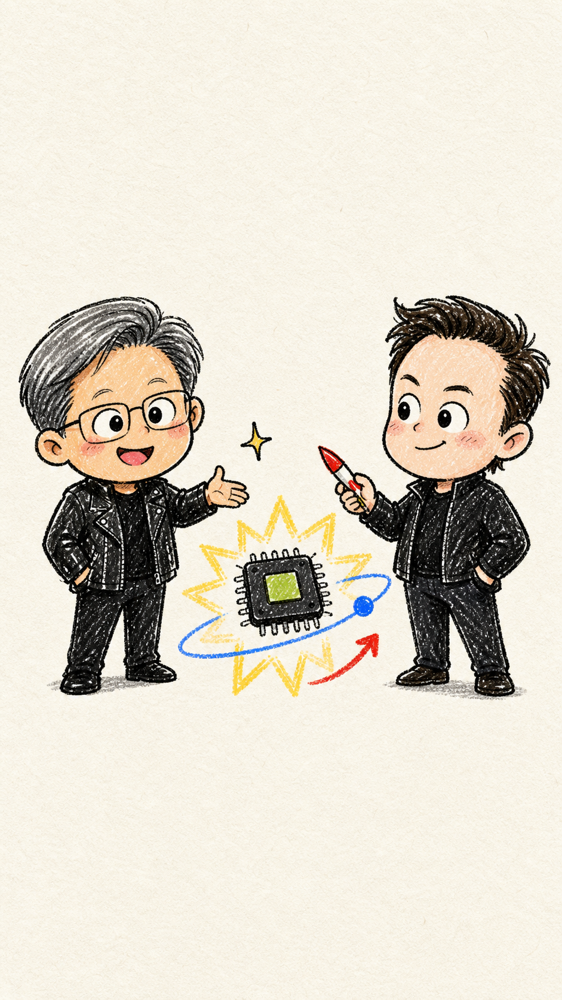
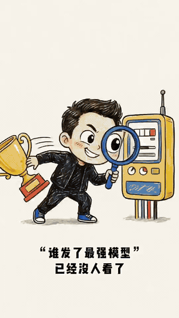
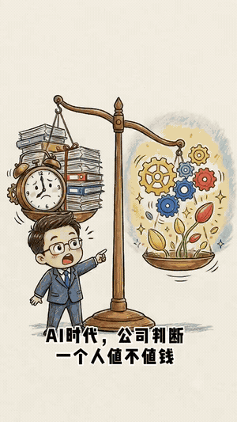
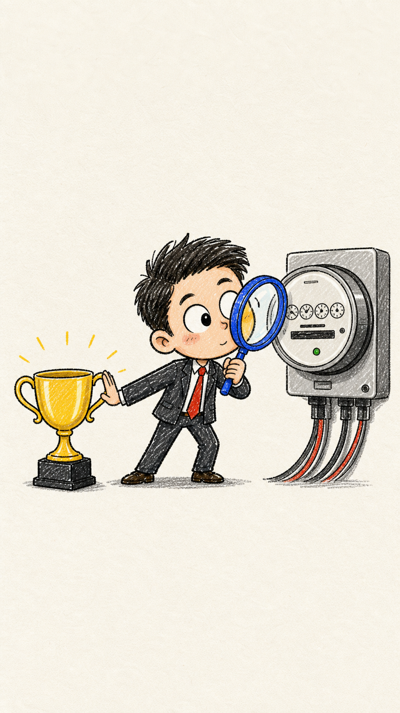
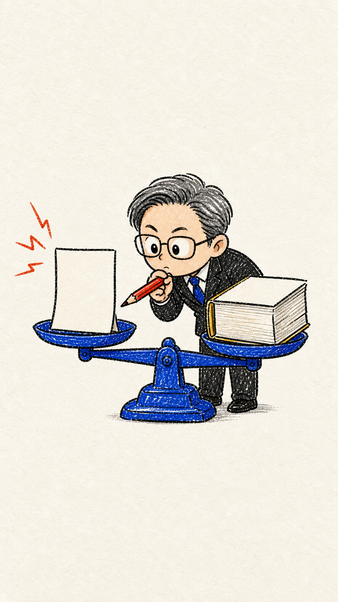
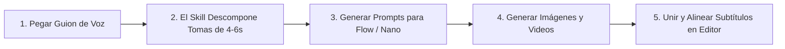

<div align="center">

[简体中文](README.md) · [English](README.en.md) · [日本語](README.ja.md) · [한국어](README.ko.md) · [**Español**](README.es.md)

# 🖍️ Hand-Drawn Video Prompts (Generador de Prompts de Video Estilo Garabato a Mano)

### Transforma guiones de voz en prompts consistentes de imagen y video 9:16 en estilo garabato con crayones y personajes chibi.

Un Skill de IA de código abierto diseñado para creadores de videos explicativos de IA, análisis financiero, tecnología y contenido educativo corto. Descompone automáticamente el guion en tomas semánticas de 4 a 6 segundos, metáforas visuales, prompts en inglés para Flow y Nano Banana, y palabras clave dibujadas a mano.


<br/>



<br/>

Ideal para: **Videos explicativos de IA, análisis de negocios, videos educativos, TikTok / Instagram Reels / YouTube Shorts**.

</div>

---

## ✨ Características Principales

- ⏱️ **División Semántica de 4–6 Segundos**: Cortes guiados por la lógica narrativa y el ritmo del discurso, no por número arbitrario de palabras.
- 🖍️ **Estética de Garabato Chibi con Crayón**: Fondo fijo de papel blanco cálido `#F8F6EF`, trazos gruesos de tinta negra y detalles en amarillo girasol, azul cobalto y rojo tomate.
- 🎬 **Entrega Dual de Prompts (Imagen + Movimiento)**: Prompts listos para copiar en inglés para Flow y Nano Banana.
- ✍️ **Palabras Clave Integradas a Mano**: Palabras cortas escritas directamente sobre el papel u objetos, respetando el área de subtítulos inferior.
- 🧑‍💼 **Caricaturas Chibi de Figuras Públicas**: Representación expresiva y no fotorrealista de personalidades como Elon Musk, Jensen Huang o Mark Zuckerberg.
- 🎯 **Precisión de Entidades por Capas**: Directrices para banderas, logotipos y cifras exactas mediante capas deterministas en postproducción.

---

## 🎬 Demostración de Videos Generados

Mira los videos verticales generados con este flujo de trabajo directamente (**haz clic en el GIF para abrir el video en HD con sonido**):

<div align="center">

| 📱 Caso 1: Inversión en IA y Realidad Financiera (Demo 722) | 📱 Caso 2: Validación Tecnológica (Demo 723) |
|:---:|:---:|
| <a href="demo/hand-drawn-video-demo-722.mp4"></a> | <a href="demo/hand-drawn-video-demo-723.mp4"></a> |
| ⏱️ **Video de 32s** · [Abrir Video 🔊](demo/hand-drawn-video-demo-722.mp4) | ⏱️ **Video de 41s** · [Abrir Video 🔊](demo/hand-drawn-video-demo-723.mp4) |

</div>

---

## 📋 Ejemplo de Prompts Generados

<div align="center">

| Muestra Estática Toma 01 (Fondo `#F8F6EF`) | Muestra Estática Toma 02 (Metáfora Visual) |
|:---:|:---:|
|  |  |

</div>

### 🎬 Toma 01: Carrera Tecnológica de Microchips
> **Guion de Voz**: "Los cuatro gigantes tecnológicos gastaron 200 mil millones en chips en un año, pero Wall Street se pregunta: ¿dónde está el retorno?"  
> **Duración Sugerida**: 5 segundos  
> **Metáfora Visual**: Cuatro ejecutivos chibi empujando carretillas llenas de chips brillantes hacia una montaña empinada, mientras una mano gigante los examina con una lupa.  
> **Palabra Clave en Imagen**: "2000亿"

```text
[Flow Image Prompt]
Modern minimalist crayon doodle illustration, vertical 9:16, warm off-white fine-textured paper background #F8F6EF, thick imperfect black ink outlines. Four cute expressive chibi tech executives in simple business attire pushing wheelbarrows piled high with glowing GPU microchips toward a steep mountain peak. In the clean upper sky, a giant whimsical hand with a gold ring holds a magnifying glass inspecting them. Warm sunlight yellow, cobalt blue, tomato red accents. Hand-drawn Chinese text "2000亿" naturally written in black crayon on the side of a wheelbarrow. Clear composition with generous negative space, empty clean area at bottom reserved for subtitles.

[Flow Image-to-Video Prompt]
Gentle 2D hand-drawn stop-motion animation. The four chibi executives strain forward cheerfully pushing their wheelbarrows, wheels wobbling slightly. The magnifying glass in the sky pans smoothly from left to right as a beam of warm light highlights the glowing chips. Tiny paper-grain particles float subtly in the air. Fixed #F8F6EF background color with zero flicker.
```

---

## 🛠️ Flujo de Trabajo



---

## 📦 Instalación y Uso

```bash
git clone https://github.com/kaomei/hand-drawn-video-prompts.git
cd hand-drawn-video-prompts

# Para Antigravity / Gemini CLI
cp -R hand-drawn-video-prompts ~/.gemini/config/skills/hand_drawn_video_prompts

# Para Codex CLI
cp -R hand-drawn-video-prompts "${CODEX_HOME:-$HOME/.codex}/skills/hand_drawn_video_prompts"
```

---

## ⚠️ Aviso Legal y Derechos (Disclaimer)

1. **Proyecto No Oficial**: Este repositorio es una herramienta de ingeniería de prompts y **no tiene afiliación oficial con empresas tecnológicas o plataformas de IA**.
2. **Personajes Públicos y Marcas**: Las figuras públicas son representadas en estilo caricatura no fotorrealista. Los logotipos deben añadirse como capas deterministas en postproducción.
3. **Uso Permitido**: Para fines de aprendizaje, investigación y creación de contenido legítimo.

---

## 🤝 Contribuciones

¡Las sugerencias de nuevas metáforas visuales y mejoras de prompts son bienvenidas!

Si este proyecto te ha sido útil, **¡dale una ⭐️ Star para apoyar a kaomei (烤妹儿)!**

## 📄 Licencia

[MIT License](LICENSE) © 2026 [kaomei](https://github.com/kaomei)
