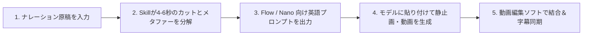

<div align="center">

[简体中文](README.md) · [English](README.en.md) · [**日本語**](README.ja.md) · [한국어](README.ko.md) · [Español](README.es.md)

# 🖍️ Hand-Drawn Video Prompts (手描き風動画プロンプトジェネレーター)

### ナレーション原稿を、9:16の今どき可愛いちびキャラ×クレヨン手描き風動画プロンプトへ一発変換。

AI解説、金融・ビジネス考察、テクノロジー評論、教育系ショート動画クリエイターのためのオープンソース AI Skill。原稿を4〜6秒のセマンティックカット、視覚的メタファー、Flow / Nano Banana 向け画像＆動画プロンプト、イラスト内手描きキーワードへと自動分解し、画風のブレや背景色ズレ、字幕被りの悩みを解消します。


<br/>


<br/>

適用シーン：**AI・テクノロジー解説、ビジネス・経済解説、教養・教育系ショート動画、TikTok / YouTube Shorts / Instagram リール制作**。

</div>

---

## ✨ 主な特徴

- ⏱️ **4〜6秒の黄金セマンティックカット分割**：機械的な文字数区切りではなく、論理の展開や感情の転換に合わせた自然なカット割り。
- 🖍️ **モダンなちびキャラ×クレヨン手描き美学**：固定された `#F8F6EF` ウォームホワイト紙テクスチャ、味のある太い黒インク線、ひまわりイエロー・コバルトブルー・トマトレッドのアクセント。
- 🎬 **静止画＋動画プロンプトのデュアル生成**：Flow / Nano Banana にそのまま使える高品質な英語プロンプトを即座に出力。
- ✍️ **イラストに溶け込む手描きキーワード**：付箋やカードではなく、紙面やオブジェクト上に自然に描かれる短いキーワード。下部字幕エリアも完全確保。
- 🧑‍💼 **著名人のちびキャラ化**：イーロン・マスク、ジェンスン・フアン、マーク・ザッカーバーグなどの特徴を捉えた親しみやすいキャラクター描写。
- 🎯 **実体再現性の階層化アプローチ**：国旗、ブランドロゴ、数値などの正確性を保つためのレイヤー分離とリファレンス活用。

---

## 🎬 生成サンプルの動的プレビュー

本ワークフローで生成された縦型動画のサンプルを直接確認できます（**GIFをクリックすると音声付きフルHD動画が開きます**）：

<div align="center">

| 📱 事例1：AI設備投資と現実 (Demo 722) | 📱 事例2：技術検証とビジネス化 (Demo 723) |
|:---:|:---:|
| <a href="demo/hand-drawn-video-demo-722.mp4"></a> | <a href="demo/hand-drawn-video-demo-723.mp4"></a> |
| ⏱️ **32秒動画** · [動画を開く 🔊](demo/hand-drawn-video-demo-722.mp4) | ⏱️ **41秒動画** · [動画を開く 🔊](demo/hand-drawn-video-demo-723.mp4) |

</div>

---

## 📋 プロンプト生成例

<div align="center">

| カット 01 静止画サンプル (`#F8F6EF` 背景) | カット 02 静止画サンプル (メタファー構図) |
|:---:|:---:|
|  |  |

</div>

### 🎬 カット 01: テック大手のGPU開発競争
> **ナレーション原稿**：「巨大テック4社が1年で2000億ドルを半導体に投じたが、ウォール街は問い始めている――リターンはどこにあるのか？」  
> **推奨時間**：5秒  
> **視覚メタファー**：光るGPUチップを満載した手押し車を押すちびキャラ役員たちと、上空から虫眼鏡で観察する巨大な手。  
> **内包キーワード**：「2000亿」

```text
【Flow 画像生成プロンプト】
Modern minimalist crayon doodle illustration, vertical 9:16, warm off-white fine-textured paper background #F8F6EF, thick imperfect black ink outlines. Four cute expressive chibi tech executives in simple business attire pushing wheelbarrows piled high with glowing GPU microchips toward a steep mountain peak. In the clean upper sky, a giant whimsical hand with a gold ring holds a magnifying glass inspecting them. Warm sunlight yellow, cobalt blue, tomato red accents. Hand-drawn Chinese text "2000亿" naturally written in black crayon on the side of a wheelbarrow. Clear composition with generous negative space, empty clean area at bottom reserved for subtitles.

【Flow 動画生成プロンプト】
Gentle 2D hand-drawn stop-motion animation. The four chibi executives strain forward cheerfully pushing their wheelbarrows, wheels wobbling slightly. The magnifying glass in the sky pans smoothly from left to right as a beam of warm light highlights the glowing chips. Tiny paper-grain particles float subtly in the air. Fixed #F8F6EF background color with zero flicker.
```

---

## 🛠️ 制作ワークフロー



---

## 📦 インストール方法

```bash
git clone https://github.com/kaomei/hand-drawn-video-prompts.git
cd hand-drawn-video-prompts

# Antigravity / Gemini CLI の場合
cp -R hand-drawn-video-prompts ~/.gemini/config/skills/hand_drawn_video_prompts

# Codex CLI の場合
cp -R hand-drawn-video-prompts "${CODEX_HOME:-$HOME/.codex}/skills/hand_drawn_video_prompts"
```

---

## ⚠️ 免責事項・知的財産権について (Disclaimer)

1. **非公式プロジェクト**：本プロジェクトはオープンソースのプロンプト設計スキルであり、**記載されたいかなる企業・人物・AIプラットフォームとも提携関係はありません**。
2. **実在人物とロゴ**：実在の人物は非写実的なちびキャライラストとしてのみ表現されます。企業ロゴ等は編集時のレイヤー追加を推奨します。
3. **利用範囲**：個人の学習、研究、適法なコンテンツ制作にご利用ください。

---

## 🤝 コントリビューション

新しい視覚メタファーのアイデアやプロンプト改善の PR を歓迎します！

このプロジェクトが役に立ちましたら、**ぜひ Star ⭐️ をつけて kaomei（烤妹儿）を応援してください！**

## 📄 ライセンス

[MIT License](LICENSE) © 2026 [kaomei](https://github.com/kaomei)
