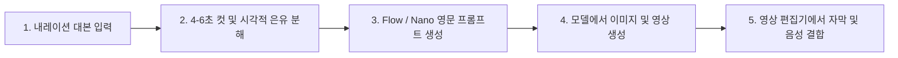

<div align="center">

[简体中文](README.md) · [English](README.en.md) · [日本語](README.ja.md) · [**한국어**](README.ko.md) · [Español](README.es.md)

# 🖍️ Hand-Drawn Video Prompts (손그림 크레용풍 숏폼 프롬프트 생성기)

### 내레이션 대본을 9:16 귀여운 미니멀 손그림 크레용풍 이미지 및 비디오 프롬프트로 한 번에 변환.

AI 지식 해설, 테크/경제 리뷰, 교육용 숏폼 크리에이터를 위한 오픈소스 AI Skill. 대본을 4~6초 단위의 시맨틱 컷, 시각적 은유, Flow / Nano Banana 맞춤형 영문 이미지 및 비디오 생성 프롬프트, 손글씨 키워드로 자동 분해하여 스타일 일관성과 자막 가독성을 완벽하게 보장합니다.


<br/>


<br/>

활용 분야: **AI 테크 해설, 경제/비즈니스 분석, 지식 정보 숏폼, 틱톡 / 릴스 / 유튜브 쇼츠 콘텐츠 제작**.

</div>

---

## ✨ 핵심 기능

- ⏱️ **4~6초 황금 시맨틱 컷 분할**: 단순 글자 수 기준이 아닌 논리 전개와 감정 변화에 맞춘 자연스러운 컷 구성.
- 🖍️ **현대적 크레용 손그림 미학**: 고정된 `#F8F6EF` 웜 화이트 종이 질감, 두껍고 자연스러운 잉크 라인, 해바라기 옐로우/코발트 블루/토마토 레드 포인트 컬러.
- 🎬 **정지 이미지 + 영상 모션 듀얼 프롬프트**: Flow / Nano Banana 모델에 바로 복사해 쓰는 영문 프롬프트 동시 생성.
- ✍️ **그림과 어우러지는 손글씨 키워드**: 포스트잇 형태가 아닌 종이나 오브젝트 위에 자연스럽게 적히는 키워드, 하단 자막 여백 100% 확보.
- 🧑‍💼 **유명 인물의 개성 있는 캐릭터화**: 일론 머스크, 젠슨 황, 저커버그 등을 특징적인 카툰 아바타로 표현.
- 🎯 **엔티티 정확도 관리**: 국기, 브랜드 로고, 핵심 수치 등을 후반 레이어로 분리하여 정확성과 일관성 유지.

---

## 🎬 생성 영상 동적 미리보기

이 워크플로우로 제작된 세로형 숏폼 예시를 바로 확인해보세요 (**GIF를 클릭하면 소리가 포함된 풀 HD 영상이 열립니다**):

<div align="center">

| 📱 사례 1: AI 투자와 시장 현실 (Demo 722) | 📱 사례 2: 기술 검증과 비즈니스화 (Demo 723) |
|:---:|:---:|
| <a href="demo/hand-drawn-video-demo-722.mp4"></a> | <a href="demo/hand-drawn-video-demo-723.mp4"></a> |
| ⏱️ **32초 완성본** · [영상 열기 🔊](demo/hand-drawn-video-demo-722.mp4) | ⏱️ **41초 완성본** · [영상 열기 🔊](demo/hand-drawn-video-demo-723.mp4) |

</div>

---

## 📋 프롬프트 생성 예시

<div align="center">

| 컷 01 정지 이미지 샘플 (`#F8F6EF` 배경) | 컷 02 정지 이미지 샘플 (시각적 은유) |
|:---:|:---:|
|  |  |

</div>

### 🎬 컷 01: 빅테크 기업의 GPU 군비경쟁
> **내레이션 대본**: "빅테크 4대 기업이 1년에 2000억 달러를 칩에 쏟아부었지만, 월가는 묻기 시작했습니다: 수익은 어디에 있는가?"  
> **권장 길이**: 5초  
> **시각적 은유**: 빛나는 GPU 칩을 가득 실은 수레를 밀며 가파른 산을 오르는 경영진들과, 하늘 위에서 돋보기로 지켜보는 거대한 손.  
> **화면 손글씨 키워드**: "2000亿"

```text
【Flow 이미지 생성 프롬프트】
Modern minimalist crayon doodle illustration, vertical 9:16, warm off-white fine-textured paper background #F8F6EF, thick imperfect black ink outlines. Four cute expressive chibi tech executives in simple business attire pushing wheelbarrows piled high with glowing GPU microchips toward a steep mountain peak. In the clean upper sky, a giant whimsical hand with a gold ring holds a magnifying glass inspecting them. Warm sunlight yellow, cobalt blue, tomato red accents. Hand-drawn Chinese text "2000亿" naturally written in black crayon on the side of a wheelbarrow. Clear composition with generous negative space, empty clean area at bottom reserved for subtitles.

【Flow 비디오 생성 프롬프트】
Gentle 2D hand-drawn stop-motion animation. The four chibi executives strain forward cheerfully pushing their wheelbarrows, wheels wobbling slightly. The magnifying glass in the sky pans smoothly from left to right as a beam of warm light highlights the glowing chips. Tiny paper-grain particles float subtly in the air. Fixed #F8F6EF background color with zero flicker.
```

---

## 🛠️ 제작 워크플로우



---

## 📦 설치 및 실행

```bash
git clone https://github.com/kaomei/hand-drawn-video-prompts.git
cd hand-drawn-video-prompts

# Antigravity / Gemini CLI
cp -R hand-drawn-video-prompts ~/.gemini/config/skills/hand_drawn_video_prompts

# Codex CLI
cp -R hand-drawn-video-prompts "${CODEX_HOME:-$HOME/.codex}/skills/hand_drawn_video_prompts"
```

---

## ⚠️ 면책 조항 및 안내 (Disclaimer)

1. **비공식 프로젝트**: 본 프로젝트는 오픈소스 프롬프트 템플릿 도구이며, **언급된 기업, 인물, AI 플랫폼과 상업적 제휴 관계가 없습니다**.
2. **인물 및 상표**: 유명 인물은 비실사 카툰 형태로만 묘사되며, 상표 및 로고는 후반 편집 작업을 권장합니다.
3. **사용 범위**: 개인 학습, 연구 및 합법적인 콘텐츠 제작에 활용하시기 바랍니다.

---

## 🤝 기여 안내

새로운 시각적 은유 아이디어 및 프롬프트 개선 PR을 환영합니다!

이 프로젝트가 도움이 되셨다면, **Star ⭐️를 눌러 kaomei(烤妹儿)를 응원해주세요!**

## 📄 라이선스

[MIT License](LICENSE) © 2026 [kaomei](https://github.com/kaomei)
