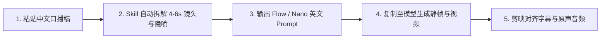

<div align="center">

[**简体中文**](README.md) · [English](README.en.md) · [日本語](README.ja.md) · [한국어](README.ko.md) · [Español](README.es.md)

# 🖍️ Hand-Drawn Video Prompts (手绘风视频提示词生成器)

### 把中文口播文案，一键转为 9:16 现代 Q 版手绘蜡笔风短视频生图与图生视频提示词

一款专为 AI 解说、财经观察、科技评论与知识型短视频创作者打造的开源 Skill。将文案自动拆解为 4–6 秒语义镜头、视觉隐喻、英文生图 Prompt、图生视频 Prompt 与内嵌手绘关键词，彻底解决生成画风漂移、背景不统一与字幕遮挡痛点。


<br/>


<br/>

适用于：**AI 科技解说、财经商业观察、知识科普短视频、商业模式拆解、小红书/抖音/视频号/TikTok/Shorts 爆款内容创作**。

</div>

---

## ✨ 核心亮点 (Features)

- ⏱️ **4–6 秒黄金语义镜头拆解**：告别机械字数断句，紧扣口播逻辑节拍、观点推进与情绪转折精准分镜。
- 🖍️ **现代 Q 版蜡笔手绘美学**：锁定 `#F8F6EF` 暖白纸张底色、自然粗黑手绘线条与向日葵黄/钴蓝/番茄红经典点缀。
- 🎬 **生图 + 图生视频双重 Prompt 交付**：直接输出适用于 Flow / Nano Banana 的英文生图提示词与图生视频运动提示词，复制即用。
- ✍️ **手绘级内嵌中文关键词**：短词自然书写于纸面或物体旁，融入插画整体，杜绝突兀便利贴，并严格预留底部字幕安全区。
- 🧑‍💼 **科技与商业人物 Q 版化**：将马斯克、黄仁勋（老黄）、扎克伯格等知名人物转化为高辨识度 Q 版卡通形象（发型、眼镜、皮衣、特征道具）。
- 🎯 **实体准确性分层提醒**：针对国旗、品牌 Logo、关键数字与长文本提供精准参考图建议与后处理层分流，确保内容严谨可信。

---

## 🎬 视频动态效果直观展示 (Video Showcase)

无需下载或跳转，直接查看通过本工作流生成的竖版短视频动态预览（**点击动图可直接打开带声音的完整高清视频**）：

<div align="center">

| 📱 案例一：AI 资本支出与商业闭环 (Demo 722) | 📱 案例二：技术落地与现实验证 (Demo 723) |
|:---:|:---:|
| <a href="demo/hand-drawn-video-demo-722.mp4"></a> | <a href="demo/hand-drawn-video-demo-723.mp4"></a> |
| ⏱️ **32 秒成片** · [点击打开原片 🔊](demo/hand-drawn-video-demo-722.mp4) | ⏱️ **41 秒成片** · [点击打开原片 🔊](demo/hand-drawn-video-demo-723.mp4) |

</div>

---

## 📋 提示词生成范例 (Example Prompts)

<div align="center">

| 镜头 01 静帧样片 (`#F8F6EF` 底色) | 镜头 02 静帧样片 (视觉隐喻构图) |
|:---:|:---:|
|  |  |

</div>

### 🎬 镜头 01: 科技巨头算力军备竞赛
> **对应口播**：“四大科技巨头一年砸了 2000 亿美金买卡，但华尔街开始问：回报究竟在哪里？”  
> **建议时长**：5 秒  
> **视觉隐喻**：四个 Q 版巨头推着装满发光芯片的独轮车冲向高山，上方有一双戴着金戒指的华尔街大手拿着放大镜审视。  
> **画面中文关键词**：“2000亿”

```text
【Flow 生图提示词】
Modern minimalist crayon doodle illustration, vertical 9:16, warm off-white fine-textured paper background #F8F6EF, thick imperfect black ink outlines. Four cute expressive chibi tech executives in simple business attire pushing wheelbarrows piled high with glowing GPU microchips toward a steep mountain peak. In the clean upper sky, a giant whimsical hand with a gold ring holds a magnifying glass inspecting them. Warm sunlight yellow, cobalt blue, tomato red accents. Hand-drawn Chinese text "2000亿" naturally written in black crayon on the side of a wheelbarrow. Clear composition with generous negative space, empty clean area at bottom reserved for subtitles.

【Flow 图生视频提示词】
Gentle 2D hand-drawn stop-motion animation. The four chibi executives strain forward cheerfully pushing their wheelbarrows, wheels wobbling slightly. The magnifying glass in the sky pans smoothly from left to right as a beam of warm light highlights the glowing chips. Tiny paper-grain particles float subtly in the air. Fixed #F8F6EF background color with zero flicker.
```

---

## 🛠️ 创作工作流 (Workflow)



1. **输入文案**：粘贴一段 30–60 秒的中文口播或解说词。
2. **智能分镜**：Skill 自动分析语义，划分节奏，匹配直观幽默的视觉隐喻并提炼画面关键词。
3. **获取双 Prompt**：生成对应的英文生图 Prompt（包含固定 `#F8F6EF` 背景与构图约束）及图生视频运动 Prompt。
4. **视频生成**：复制生图 Prompt 至 Flow / Nano Banana 生成完成静帧；再将静帧作为 Last Frame、空白暖白纸作为 First Frame 生成视频。
5. **快速剪辑**：导入剪映或 Premiere，无缝拼接视频片段并自动对齐字幕。

---

## 📦 安装与使用 (Installation)

### 在 Antigravity / Gemini CLI / Codex 中安装：

克隆本项目仓库：

```bash
git clone https://github.com/kaomei/hand-drawn-video-prompts.git
cd hand-drawn-video-prompts
```

复制技能文件至你的 skills 目录：

```bash
# Antigravity / Gemini CLI
cp -R hand-drawn-video-prompts ~/.gemini/config/skills/hand_drawn_video_prompts

# Codex CLI
cp -R hand-drawn-video-prompts "${CODEX_HOME:-$HOME/.codex}/skills/hand_drawn_video_prompts"
```

在对话中输入：

```text
请把下面这段中文口播稿拆成 Flow 生图和图生视频提示词，关键词直接写在画面里，背景固定为 #F8F6EF，底部留字幕区：

AI 让想法变得更便宜，但现实验证仍然很慢。
```

---

## 🎨 视觉基线规范 (Visual Baseline)

| 维度 | 规范标准 | 核心设计意图 |
|---|---|---|
| **画布底色** | 固定纯色 `#F8F6EF` | 杜绝暗角、脏色渐变与镜头间底色闪烁 |
| **线条质感** | 粗黑不规则手绘墨线 (Thick crayon lines) | 营造质朴、温润、极具亲和力的手作质感 |
| **色彩搭配** | 向日葵黄 + 钴蓝 + 番茄红 (三原色点缀) | 主次分明，色彩克制，避免视觉疲劳 |
| **画面留白** | 2–4 个主要视觉组，底部 15% 绝对留白 | 确保移动端信息流中不被平台 UI 和字幕遮挡 |
| **文字内嵌** | 仅保留 2–4 字短词，写在纸面或物体表面 | 与画面融为一体，不使用白卡贴纸或卡片框 |

---

## ⚠️ 免责声明与版权提示 (Disclaimer)

1. **非官方声明**：本项目（`hand-drawn-video-prompts`）为一个开源的 AI 提示词工程规范与创作模板，**与文中涉及的任何科技公司、公众人物或生成模型平台均无商业合作或关联**。
2. **公众人物与商标**：涉及的科技人物（如马斯克、黄仁勋等）仅采用明显非写实的 Q 版艺术化表现，严禁用于伪造身份或侵权；公司 Logo 与商标建议在后期确定性图层添加。
3. **用途限定**：本 Skill 生成的提示词仅供个人学习、技术探索与合规的自媒体视频创作使用。

---

## 🤝 欢迎贡献 (Contributing)

欢迎提交 PR 扩充更多视觉隐喻案例、优化图生视频运动提示词或分享精美的成片范例！

如果这个项目对你的短视频创作有所启发，**请给项目点一个 ⭐️ Star 支持烤妹儿！**

## 📄 开源协议 (License)

[MIT License](LICENSE) © 2026 [kaomei](https://github.com/kaomei)
